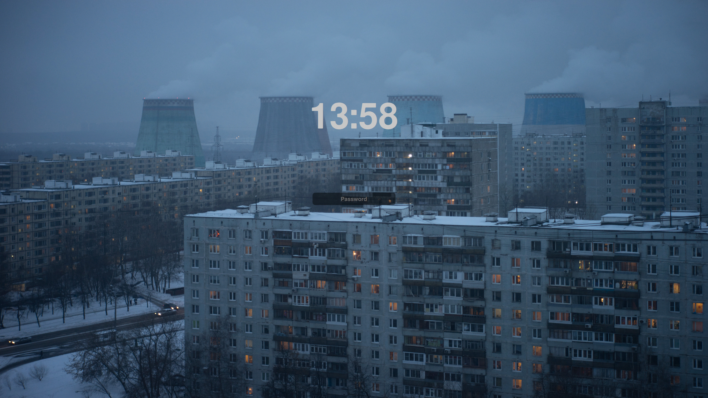
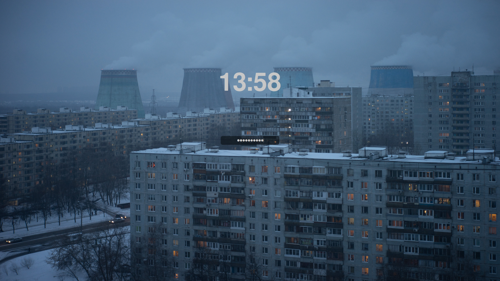

# Minimal theme for sddm

## Preview:

## Installation:

Clone the repo and move `minimal/` into `/usr/share/sddm/themes/`, inside `Main.qml` change `userName` to your user name, then add `Current=minimal` to `/etc/sddm.conf` or into `/etc/sddm.conf.d/`.

Install script might follow, maybe not, idk.
